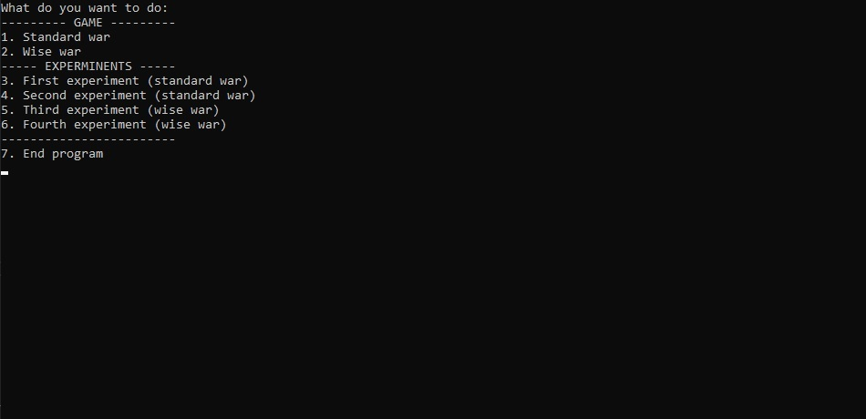
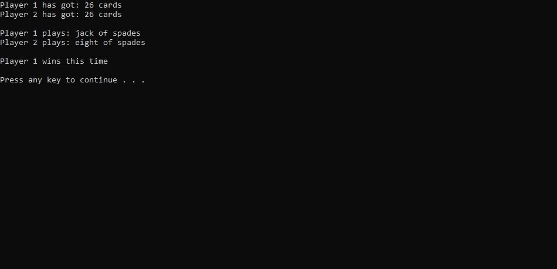
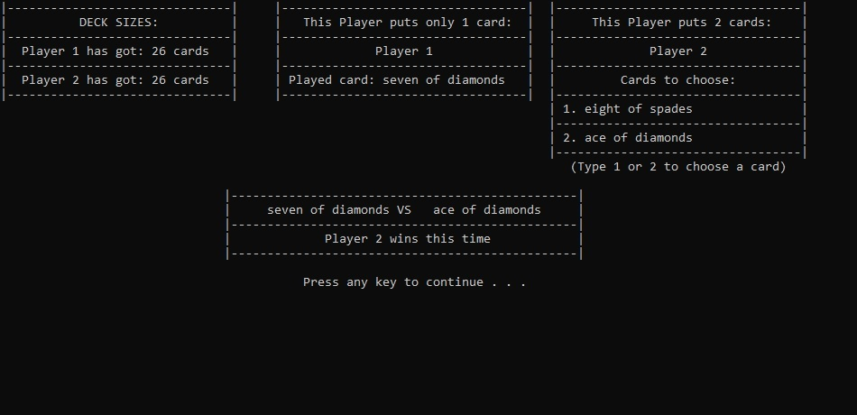

# War - Card Game

## Sections

 - [Visuals](#visuals)
 - [Description](#description)
	 - [General](#general)
	 - [Main features](#main-features)
	 - [Programming languages and libraries](#programming-languages-and-libraries)
 - [Usage](#usage)

## Visuals

**Menu**

**Standard War**

**Wise War**

## Description

### General
University project, which lets you simulate or play war card game

### Main features

#### Standard War
Program lets you simulate war card game in two different modes:
- Mode A - If player runs out of cards during war, then he loses instantly
- Mode B - If player (X) runs out of cards during war, then:
	- If (X) started war with only one card, then his opponent lends him two cards
	- If (X) started war with only two cards, then his opponent lends him one card
	- If an opponent doesn't have any cards to lend, then (X) loses

#### Wise War
Program lets you simulate and play wise war card game.
In wise war first player plays his first card just like in standard war game, but then the second player gets two cards from his deck and they choose the card that they will play. In the next round they do it in reverse order
- When simulating wise war, player can choose four different strategies for each player
	- Random: Player chooses random card
	- Furious: Player always chooses card which will cause war. If it is not possible then he plays a weaker card
	- Peaceful: Player always avoids war. Player always try to play his weaker card

#### Experiments
Program lets you carry out four experiments
- 1st experiment
	- Program writes to file average number of rounds in standard war game based on 1000 games. User can choose size of the deck.
- 2nd experiment
	- Program lets us find the best rank of the deck.
- 3rd experiment
	- Program writes to file average number of rounds in wise war game based on 1000 games. User can choose mode A or B. User can choose size of the deck.
- 4th experiment
	- Program compares two different strategies in wise war game. User can choose strategy for each player. User can choose how many games will be played Results are written to file.
	
## Programming languages and libraries
- C

## Usage
 - University project
 - playing the game
